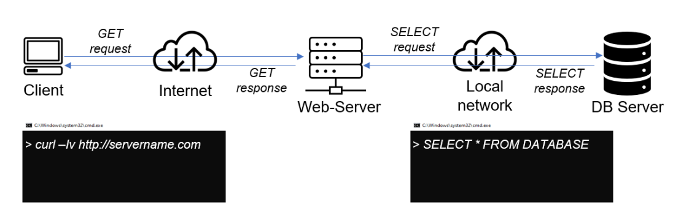
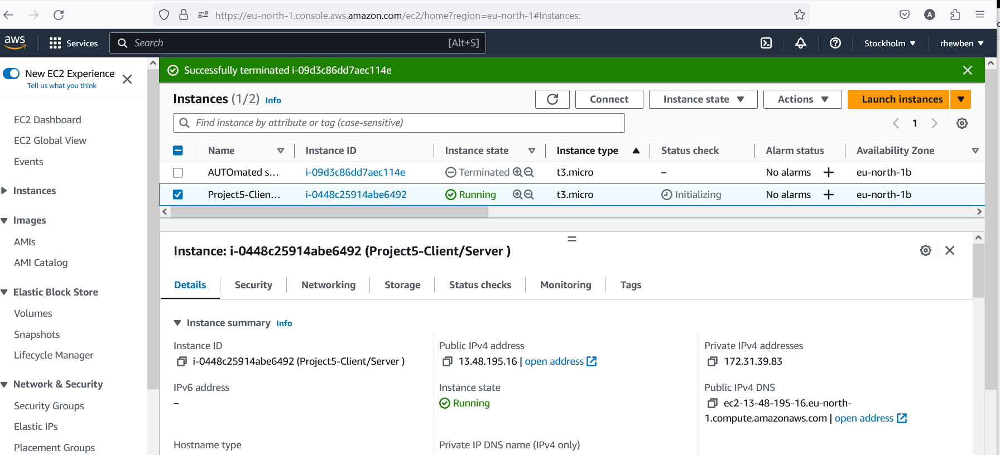
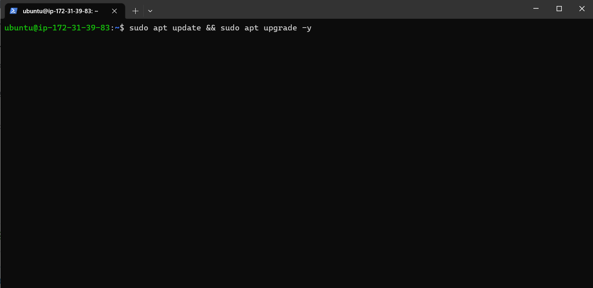
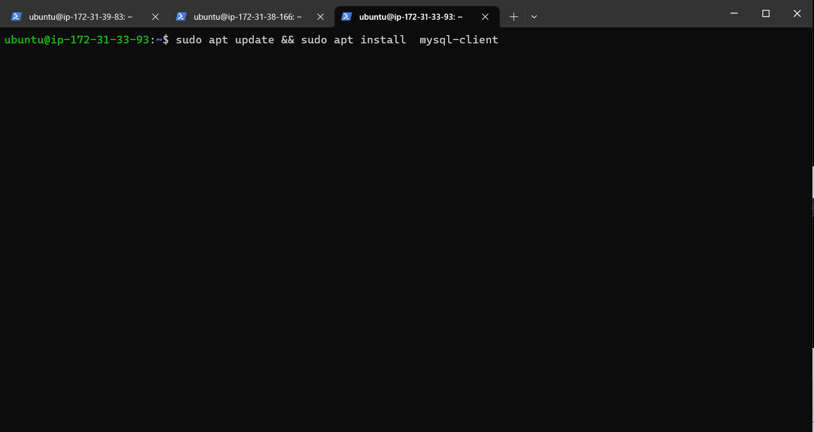
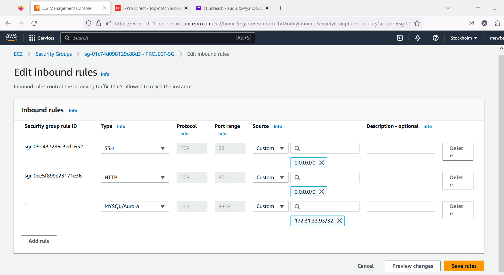
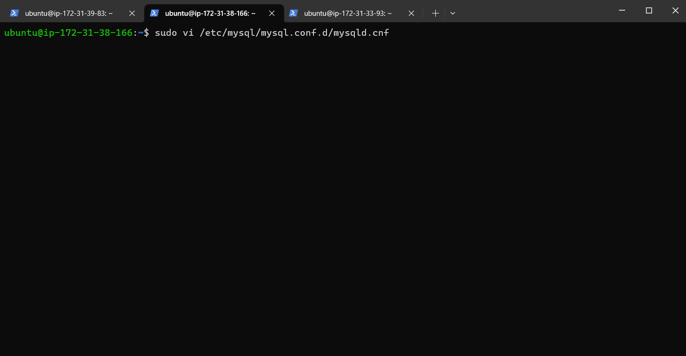
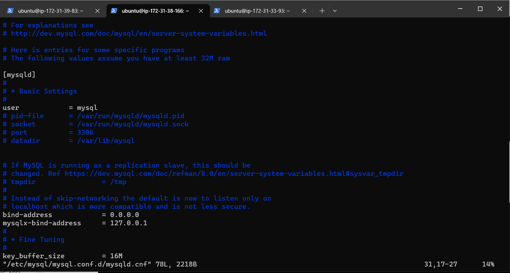
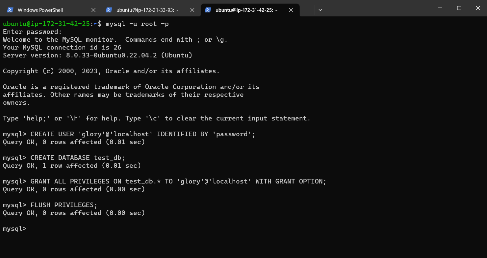
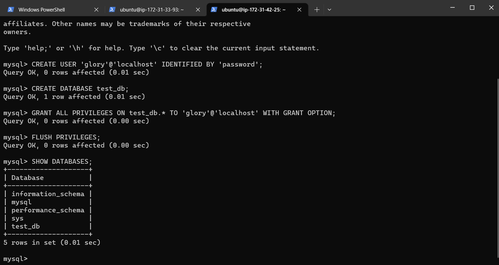

### CLIENT-SERVER ARCHITECTURE WITH MYSQL

# Project Architecture

`curl -Iv www.propitixhomes.com`

## IMPLEMENT A CLIENT SERVER ARCHITECTURE USING MYSQL DATABASE MANAGEMENT SYSTEM (DBMS).

*To demonstrate a basic client-server using MySQL Relational Database Management System (RDBMS), follow the below instructions*

*1.Create and configure two Linux-based virtual servers (EC2 instances in AWS)*

Server A name - `mysql server`
Server B name - `mysql client`

*On mysql server Linux Server install MySQL Server software*

*On mysql client Linux Server install MySQL Client software*

*By default, both of your EC2 virtual servers are located in the same local virtual network, so they can communicate to each other using local IP addresses. Use mysql server's local IP address to connect from mysql client. MySQL server uses TCP port 3306 by default, so you will have to open it by creating a new entry in ‘Inbound rules’ in ‘mysql server’ Security Groups*

*then we need  to configure MySQL server to allow connections from remote hosts*

`sudo vi /etc/mysql/mysql.conf.d/mysqld.cnf`

*Replace ‘127.0.0.1’ to ‘0.0.0.0’*

*From mysql client Linux Server connect remotely to mysql server Database Engine without using SSH. You must use the mysql utility to perform this action*

`sudo mysql`

`sudo secure_mysql_insatallation`

`sudo mysql`

*create user (rhewben)*

*create database (ben_test)*

*From mysql client Linux Server connect remotely to mysql server Database Engine without using SSH. You must use the mysql utility to perform this action.*

